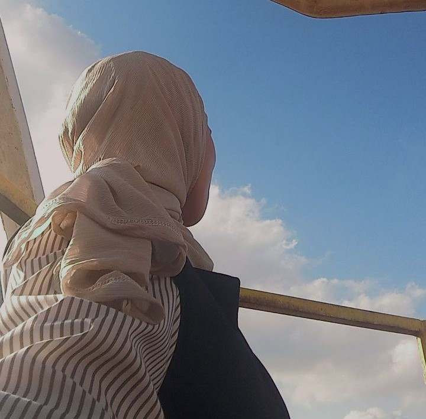
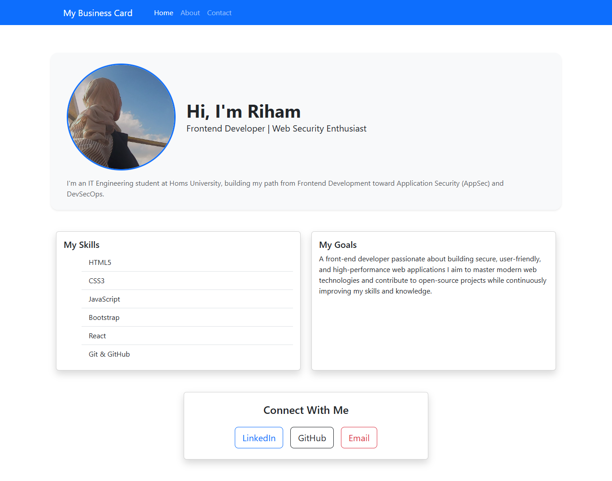

# 💼 My Business Card

A modern, responsive personal business card website built with **HTML**, **CSS**, and **Bootstrap 5**.
It serves as a digital introduction, showcasing my profile, technical skills, career goals, and social links.

## 🚀 Features

- **Responsive Design**: Works perfectly on all devices (desktop, tablet, mobile).
- **Fixed Navigation**: Easy access to sections (Home, About, Contact).
- **Profile Section**: Displays a profile picture with a brief introduction and skill badges.
- **Skills & Goals**: Organized cards highlighting my tech stack and future aspirations.
- **Social Links**: Quick access to my LinkedIn, GitHub, and Email.

## 🛠️ Technologies Used
- **HTML5**
- **CSS3**
- **Bootstrap 5** (for layout and responsive components)
- **Git & GitHub** (for version control)

- **HTML5**
- **CSS3**
- **Bootstrap 5** (for layout and responsive components)
- **Git & GitHub** (for version control)

## 📁 Project Structure
